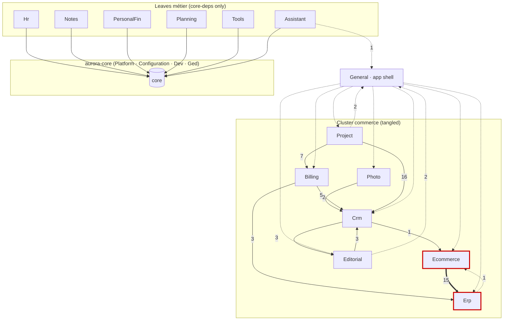

# Audit J1.2 — Graphe de dépendances inter-modules

> Livrable de la **Phase 1.2** de `audit_monorepo_split.md`, jalon **J1**.
> Snapshot **2026-05-30**. Méthode : pour chaque module `X`, comptage des
> `use Aurora\Module\<Y>` avec `Y != X`, puis inspection manuelle de la
> nature de chaque arête cross-business.

## Méthode & limites

- **Poids** = nombre de `use`-statements (proxy grossier du couplage, pas
  une mesure de criticité : 1 import peut être un blocker dur, 100 peuvent
  être triviaux).
- **FK Doctrine cross-module** : grep `targetEntity` + refs
  `Aurora\Module\X\Entity\…` dans les `Entity/` → **quasi nul**. Seul
  `General` référence des entités `Project` (cohérent avec son rôle de
  shell). Le couplage entité↔entité passe sinon par des **interfaces**
  (`CompanyInterface`, etc.) résolues par `resolve_target_entities`, pas
  par des classes concrètes → **découplage facilité**.
- **Vue cross-module** : **zéro**. `@shared` (97) = core ; `@tools` (38)
  et `@notes` (16) sont des **self-imports** internes à leur module. Les
  assets Vue se splittent sans réécrire d'imports cross-package.

## Matrice de dépendances (poids des `use` cross-module)

Colonnes = cible. Les 4 colonnes core (Platform/Config/Dev/Ged) sont
agrégées car elles partent toutes dans `aurora-core`.

| Source ↓ \ Cible → | →CORE | Bil | Crm | Eco | Edi | Erp | Pho | Prj | Gen |
|---|---:|---:|---:|---:|---:|---:|---:|---:|---:|
| Assistant | 35 | | | | | | | | 1 |
| Hr | 18 | | | | | | | | |
| Notes | 51 | | | | | | | | |
| PersonalFinance | 130 | | | | | | | | |
| Planning | 18 | | | | | | | | |
| Tools | 27 | | | | | | | | |
| Photo | 26 | | **5** | | | | | | |
| Billing | 29 | | **2** | | | **3** | | | |
| Erp | 17 | | | **1**⚠️ | | | | | |
| Ecommerce | 60 | | | | | **15**⚠️ | | | |
| Editorial | 67 | | | **3** | | | | | 2 |
| Crm | 22 | | | **1** | **3** | | | | |
| Project | 49 | **7** | **16** | | | | | | 2 |
| General | 36 | **5** | **4** | **2** | **13** | **1** | **2** | **4** | |

## Graphe (Mermaid)



## Analyse des composantes fortement connexes (SCC)

En ne gardant que les arêtes **business→business** (hors core, hors
General qui est un shell) :

```
Billing→Crm, Billing→Erp
Crm→Ecommerce, Crm→Editorial
Ecommerce→Erp
Editorial→Crm
Erp→Ecommerce
Photo→Crm
Project→Billing, Project→Crm
```

**Un seul vrai cycle** : `Ecommerce → Erp → Ecommerce`. Tout le reste est
un **DAG** (dépendances unilatérales). Détail :

- `Editorial → Crm → Editorial` ? Non : Crm→Editorial existe, mais
  Editorial→Crm aussi (3 refs). **À vérifier** : si Editorial↔Crm est un
  vrai cycle bidirectionnel, c'est un 2ᵉ cycle. (Crm→Editorial=3,
  Editorial→Crm=3.) → **flag Gate 1**.

## Nature des arêtes cross-business (inspection)

C'est le point clé : **le poids ne dit pas la dureté**. Échantillon
inspecté (à compléter en J2 pour les arêtes non vues) :

| Arête | Refs | Nature | Dureté | Découplage |
|---|---:|---|---|---|
| **Erp → Ecommerce** | 1 | `ProductSerializer` lit `EcommerceSettingEnum` | **soft** | Trivial : déplacer l'enum vers Erp ou core → **casse le cycle** |
| ~~**Crm → Ecommerce**~~ | 1 | `OrderCrmSyncListener` écoute `OrderCreatedEvent` | **soft (event)** | ✅ **RÉSOLU cat. B** : event core `ContactSignalEvent`, listener fusionné |
| **Editorial → Ecommerce** | 3 | `BlocksRenderer` embed un `ListingInterface` dans un post | **soft (feature opt)** | Bloc CMS optionnel ; un client CMS-only ne le charge pas (→ cat. C, à faire) |
| ~~**Crm → Editorial**~~ | 3 | `FormSubmissionCrmSyncListener` ← `FormSubmissionCreatedEvent` | **soft (event)** | ✅ **RÉSOLU cat. B** : extraction remontée dans Editorial, event core `ContactSignalEvent` |
| **Billing → Crm** | 2 | `Tiers` lié à `CompanyInterface` (relation entité) | **moyen (entité/interface)** | Lien via interface résolu par `resolve_target_entities` ; si Crm absent, relation nullable inutilisée — **à confirmer nullable en J2** |
| **Ecommerce → Erp** | 15 | `Listing`/`Order` ↔ `Product` (entité) + `CurrencyEnum` (×7) + `ProductRepository` | **DURE (sémantique)** | `CurrencyEnum` → déplacer en **core** ; le reste (Product) est intrinsèque → Ecommerce **require** Erp |
| **Project → Crm** | 16 | `Company/Contact/Deal Interface` sur `AbstractProject` (liens entité opt.) + repos hydratation | **MOYENNE** | Via interfaces (résolu par resolve_target_entities) ; nullable → soit `require`, soit bridge `aurora-project-crm` |
| **Project → Billing** | 7 | **tout dans `ProjectInvoiceManager`** (feature « facturer un projet ») | **ISOLÉE (1 classe)** | **Bridge parfait** : extraire `ProjectInvoiceManager` en `aurora-project-billing` |
| Photo → Crm | 5 | (non inspecté — probable lien galerie↔client) | ? | À auditer J2 |
| Editorial → Crm | 3 | (non inspecté) | ? | À auditer J2 (cycle potentiel avec Crm→Editorial) |

**Pattern dominant observé** : les couplages cross-business sont des
**intégrations optionnelles** (event listeners, blocs d'embed, liens
entité via interface), pas des dépendances de compilation dures. Cela
oriente fortement vers une stratégie **« split + intégrations gardées /
bridges »** plutôt que **« fusion en gros packages »**.

## Implications pour Gate 1 (décision groupings)

1. **Découpler `Erp → Ecommerce`** (1 ref, l'enum) **avant tout** → élimine
   le seul cycle certain. Coût ~trivial. Après ça, `Ecommerce → Erp`
   devient unilatéral (Ecommerce *require* Erp, ou inverse selon sémantique).
2. **Vérifier Editorial ↔ Crm** (3/3) : si vrai cycle, le casser pareil.
3. **Auditer les 3 arêtes lourdes** (Ecommerce→Erp 15, Project→Crm 16,
   Project→Billing 7) en J2 : si elles sont **dures** (services injectés,
   logique métier entrelacée), envisager des fusions :
   - `aurora-commerce` = Ecommerce + Erp (si découplage du 15 trop cher)
   - `aurora-crm` peut rester seul si Project→Crm est de l'intégration
     gardable.
4. **`General`** (shell) ne devient PAS un package métier : soit core avec
   widgets gardés, soit côté client (voir `module_inventory.md`).
5. **Leaves d'abord** : Hr, Notes, PersonalFinance, Planning, Tools,
   (Assistant) n'ont **aucune** arête cross-business → idéaux pour le POC
   et les premières extractions du rollout (J5), avant de s'attaquer au
   cluster commerce.

> **Reco POC (révision du workplan)** : le workplan propose **Billing**
> comme POC. Or Billing dépend de Crm + Erp (couplage entité). Un **leaf
> pur (Tools ou Hr, petits) ou Notes** serait un POC plus propre pour
> valider la mécanique d'extraction sans buter d'emblée sur le découplage
> cross-business. Proposer ce changement au Gate 2/J3.
